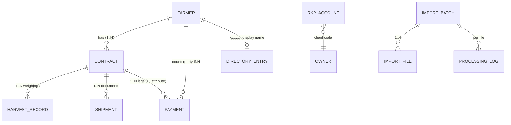

# DATA MODEL — Кунлик терим

One normalized model, built from four sources plus one maintained reference file (the ҳудуд directory).
Tables live in the existing PTZ SQLite DB (`data/ptz/ptz.sqlite`) with a `kt_` prefix. The migration is
additive (`CREATE TABLE IF NOT EXISTS`), and existing tables are untouched. The SQL is plain and
PostgreSQL-compatible apart from `AUTOINCREMENT`/`INTEGER` types.

## Entities and keys

| Entity | Identity | Source | Table |
|---|---|---|---|
| Farmer | **INN** (`Хўжалик ИННси`) | basket | derived from `kt_harvest_records.inn` |
| Contract | **deal number** = basket `Шартнома раками` = Shipments `Номер сделки` = statement `D:` | basket, shipments, statement | derived |
| HarvestRecord | natural key `rec:<contract>:<Кайд раками>` (fallback: ПК-17, then fingerprint) | basket | `kt_harvest_records` |
| Payment | natural key `tx:<ID транзакции>` | выписка | `kt_payments` |
| RkpAccount | `Л/с`; snapshot per batch | лицевые счета | `kt_rkp_accounts` |
| Shipment | natural key `shp:<deal>:<Номер документа>:<Дата документа>` | Shipments | `kt_shipments` |
| DirectoryEntry | row order; INN when known | `farmer_directory.xlsx` | file in the data dir, not the DB |
| ImportBatch | id | every run | `kt_import_batches` |
| ImportFile | id, sha256 | every file | `kt_import_files` |
| ProcessingLog | id | every file | `kt_processing_log` |
| UploadSession | UUID | Telegram | `kt_upload_sessions` |

`Номер контракта` in Shipments is **not** the farmer contract. It is the buyer's exchange clearing
contract (`119020` on every real row, and also the `C:` attribute in the statement). It is stored as
`clearingContract` / `contract_number` for traceability, never used for matching.

## Fingerprints and incremental import

| Source | Fingerprint (content hash) | Semantics |
|---|---|---|
| Basket | `hash(INN, contract, date, conditioned kg, physical kg, method, amount, ПК-17 / record №)` | **Snapshot**: the export always holds the whole season. The report uses the records present in the latest basket (`last_batch_id`); rows missing from it are reported as `REMOVED_FROM_SOURCE` and excluded. |
| Payments | `hash(date-time, account, net amount, invoice №, tx id)` | **Union**: statements for different periods/accounts accumulate. |
| Shipments | `hash(deal, clearing contract, document №, document date, quantity, status)` | **Union** |
| Accounts | — | **Snapshot** per batch (balances are point-in-time). |

Upsert rule per record: key unseen → **INSERT**; key seen with the same fingerprint → **DUPLICATE** (skip);
key seen with a different fingerprint → **UPDATE** (the source corrected it). Sending the same file twice
changes nothing. A corrected row replaces its old version instead of being added a second time.

## Matching

Priority: **INN (1.00) → contract/deal (0.95) → RKP account (0.90) → normalized name (≤ 0.80)**. A name
match below 0.80 is never accepted automatically; it is returned with its best candidate for manual review
(Data Quality).

- Name normalization: Cyrillic → Latin transliteration, apostrophe glyphs and the basket's `_` removed,
  quotes and punctuation removed, legal-form tokens (`FX`, `ФХ`, `MCHJ`, `МЧЖ`, …) dropped.
- The RKP account's **client code** is the last 9 digits of the personal account, shared by all accounts
  of one client. The code is learned from statement legs (INN + account) and used only as the 3rd
  priority.
- Farmer → ҳудуд: the directory's INN; otherwise an exact normalized-name match against INN-less
  directory rows (INFO); otherwise the farmer goes to the "Ҳудуди аниқланмаган" block (WARNING).

## Calculation rules

Reproduced from the hand-made `Кунлик терим.xlsx` and verified against the real files (DATA_PROFILE.md §6):

| Figure | Rule |
|---|---|
| Кул / Машин терим, kg | Σ `Кондицион вазни` by `Кабул қилиш › Санаси` × `Терим услуби` (HAND / MACHINE) |
| 100 % суммаси | Σ `Суммаси` (same grouping) |
| Жами | Кул + Машин |
| 20 % суммаси | 100 % × 20 % (`PICKING_MONEY_SHARE_PCT`) |
| Терим учун утказилган маблаг — Жами | Σ (Дебет − Кредит) of the farmer's statement legs (reversals net out; the company's own block legs are excluded) |
| … — Бир кунда | same, for operations on the report date |
| Терим пули учун колдик | 20 % − Утказилган (Жами) |
| Режа | Σ distinct contracts' `Шартнома миқдори` (t) — the existing module's rule |
| Report date | Date in the basket's title banner (`… 23 September 14:09 …`), else the latest acceptance date |
| Shipped kg | Σ `Кол-во отгрузки` of statuses in `SHIPMENT_COUNTED_STATUSES` (ACTIVE) per deal |

Money is exact `bigint` tiyin end to end; floats appear only when writing cells.

## BUSINESS_RULE_REQUIRED (open questions, not guessed)

1. **Режа for multi-contract farmers.** The hand-made report differs from Σ contracts for 3 farmers,
   in both directions (e.g. HAZORASP AGROTEX MCHJ: 5 contracts = 2 657.7 t in the basket vs 1 778.9 t
   in the report). The system keeps Σ contracts and flags each difference as
   `PLAN_DIFFERS_FROM_DIRECTORY`.
2. **"Кол-во сделки − Σ Кол-во отгрузки"** as a remainder. Not computed; both quantities are shown side by
   side (`SHIPMENT_REMAINING_RULE_CONFIRMED = false`).
3. **Label vs meaning of "20 % / Терим пули".** The formula is reproduced exactly (20 % of 100 % minus
   transferred money). The transfers in the statement, however, are the futures **80 %** prepayments
   (`фьючерс-80%`), so the business meaning of the remainder should be confirmed.
4. **Manual day/method moves in the hand-made report.** For 20–22.09 a few rows sit on different days or
   methods than in the basket (the 3-day total is identical). The system uses the basket as recorded.
5. **Rows awaiting lab results** (physical weight but no conditioned weight, no ПК-17) are excluded
   until the conditioned weight arrives, consistent with the weight basis; shown as
   `CONDITIONED_WEIGHT_PENDING`.
